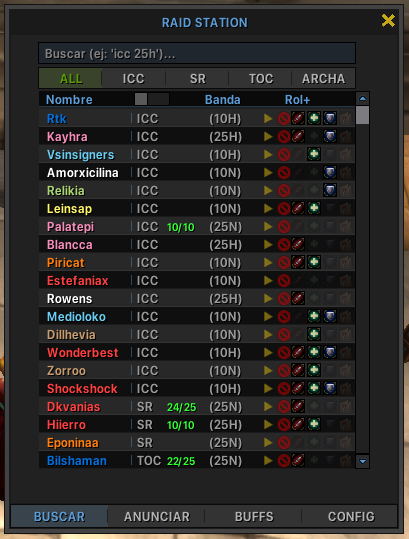
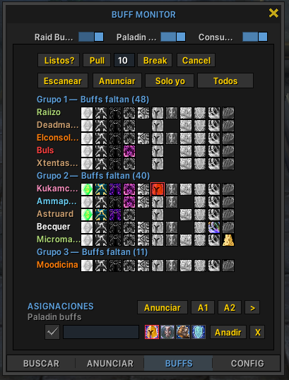
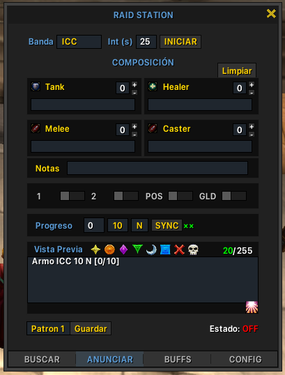
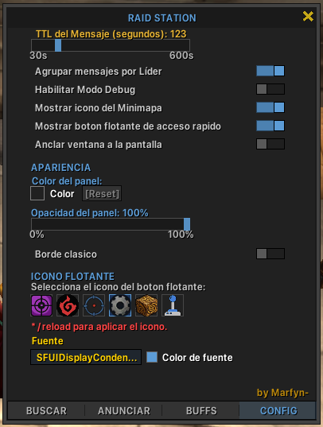

# RaidStation

> Addon de gestión de raids para World of Warcraft: Wrath of the Lich King 3.3.5a


---

## Screenshots






---

## ¿Qué es RaidStation?

RaidStation es una suite de herramientas integradas en un solo addon diseñada para líderes de raid y jugadores activos en servidores WotLK privados. Reemplaza el uso de múltiples addons separados para buscar raids, anunciar, monitorear buffs y gestionar composición.

---

## Funcionalidades

### BUSCAR
- Lista en tiempo real de jugadores que anuncian raids en el chat
- Filtros por instancia: ALL / ICC / SR / TOC / ARCHA
- Columnas: Nombre, Banda, Rol
- Congelado de lista para leer anuncios sin que desaparezcan
- Notas manuales por jugador
- Soporte de búsqueda con abreviaciones del servidor (icc, profe, lady, etc.)

### ANUNCIAR
- Formulario de anuncio de raid con selección de instancia, dificultad y rol
- Intervalo de anuncio configurable
- Throttling de mensajes via ChatThrottleLib

### BUFFS
- Monitor de buffs de raid, bendiciones de paladín y consumibles
- Escaneo automático cada 2 segundos de los 25 miembros del raid
- Detección de buff ausente / presente / versión menor / urgente (por expirar)
- Asignaciones de paladines por familia de bendición y clase objetivo
- Detección de wrongCaster vía COMBAT_LOG_EVENT_UNFILTERED
- Botones de control de raid: Ready Check, Pull (DBM), Break, Cancel
- Anuncio de faltantes al canal: Solo yo / Banda / Alerta de raid
- Alertas rápidas configurables (A1, A2)

### CONFIG
- Color de acento personalizable (todo el UI se actualiza en tiempo real)
- Color y opacidad del panel principal
- Fondos de textura opcionales (6 opciones)
- Selector de fuente (compatible con LibSharedMedia si está instalado)
- Botón flotante opcional y reposicionable
- Borde del frame activable/desactivable

---

## Instalación

1. Descarga la última versión desde [Releases](../../releases)
2. Extrae la carpeta `RaidStation` dentro de `Interface/AddOns/`
3. La estructura debe quedar: `Interface/AddOns/RaidStation/RaidStation.toc`
4. Entra al juego o escribe `/reload`
5. Escribe `/rs` para abrir el addon

> **Nota:** Si instalas por primera vez o actualizas texturas `.blp`, se requiere reinicio completo del cliente (no basta `/reload`).

---

## Dependencias

| Librería | Incluida | Uso |
|----------|----------|-----|
| LibStub | ✓ | Registro de librerías |
| CallbackHandler-1.0 | ✓ | Callbacks internos |
| ChatThrottleLib | ✓ | Envío seguro de mensajes al chat |
| LibWho-2.0 | ✓ | Consultas de jugadores |
| LibSharedMedia-3.0 | ✗ (opcional) | Fuentes adicionales — viene con ElvUI |

---

## Comandos

| Comando | Acción |
|---------|--------|
| `/rs` | Abre / cierra RaidStation |

---

## Compatibilidad

- **WoW:** 3.3.5a — build 12340
- **Interface:** 30300
- **Servidor de referencia:** wotlk.ultimowow.com
- **Otros servidores WotLK:** Compatible en general.

### Limitaciones conocidas

- Podrian mostrar listas de raid erroneamente confundiendo con anuncion de guilds(se creo un boton para eliminar las listas para la sesion actual)
- La detección de buffs por nombre depende del locale del cliente. El addon fue desarrollado y validado con cliente en español. En clientes en inglés, el scanner puede no detectar algunos buffs correctamente.
- La sincronización entre jugadores no está implementada en esta versión.

---

## Estructura del proyecto

```
RaidStation/
├── Libs/           — LibStub, ChatThrottleLib, LibWho-2.0
├── Core/           — Lógica principal (Parser, Matcher, Stats, BuffScanner...)
├── UI/             — Frames y paneles (MainFrame, BuffTab, Settings...)
├── Config/         — Datos de raids, buffs y configuración por defecto
├── Textures/       — Recursos visuales (.blp)
└── RaidStation.toc
```

---

## Changelog

Ver [CHANGELOG.md](CHANGELOG.md)

---

## Autor

**Marfyn-** — UltimoWow
<p align="left">
  <a href="https://discord.com/users/679434665764978691">
    
  </a>
</p>
Personajes: Joana - WowAcademy
Creado: 2026 — Licencia MIT  
Si redistribuyes este addon, el crédito al autor original es obligatorio.
